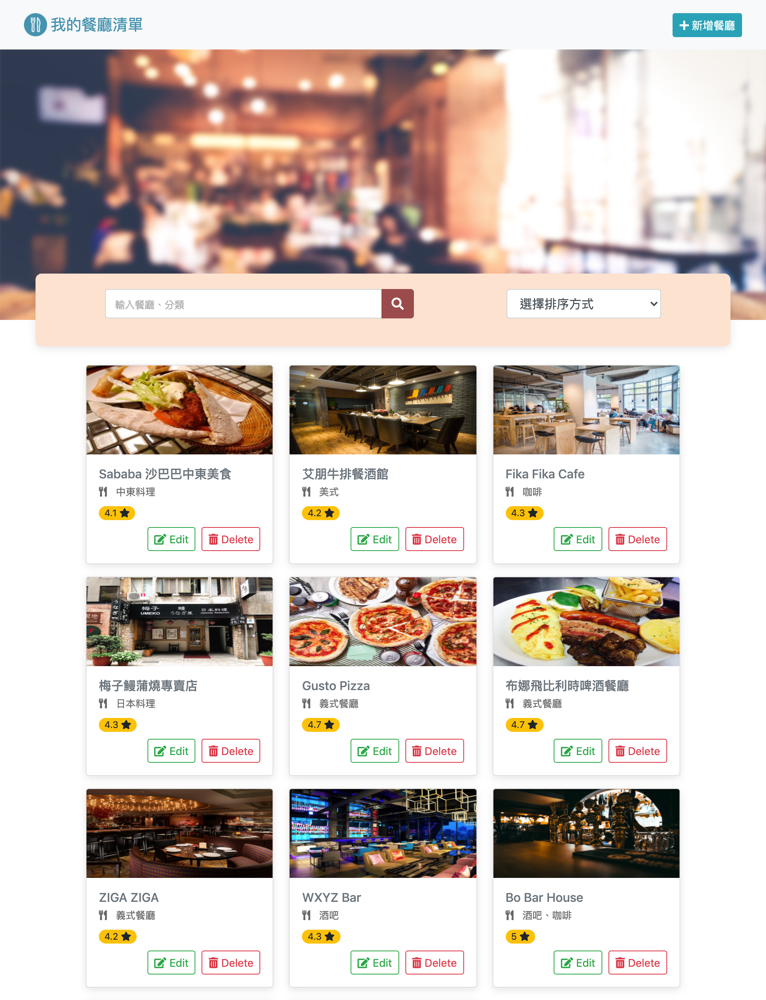
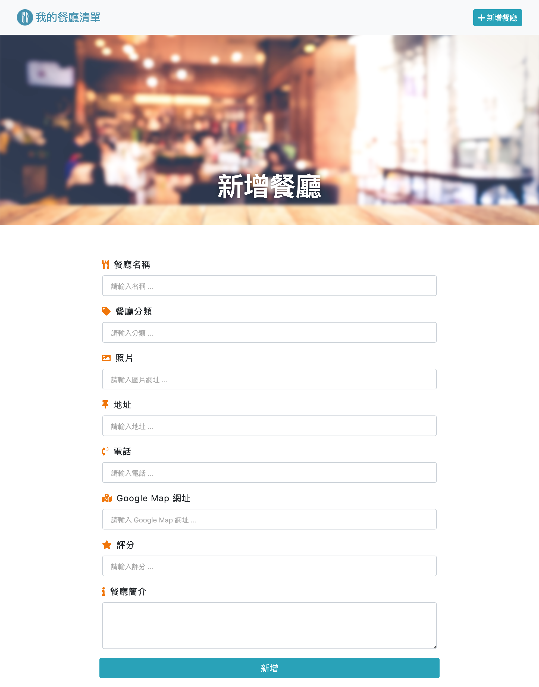

<!-- ABOUT THE PROJECT 2-3 A8: 重構餐廳清單 -->
## :page_facing_up: 重構餐廳清單 

### :heavy_check_mark: Features

1. 使用者可以從首頁瀏覽所有餐廳列表
  * 照片
  * 名稱
  * 分類
  * 評分


  
2. 使用者可以點擊餐廳圖片瀏覽餐廳詳細資訊
  * 照片
  * 名稱
  * 類別
  * 地址
  * 電話
  * 簡介
  
3. 搜尋功能：輸入餐廳名稱、餐廳分類可搜尋餐廳

4. 使用者可以從首頁點擊「新增」，新增一家餐廳



5. 使用者點擊「Edit」可以修改一家餐廳的資訊

6. 使用者點擊「Delete」可以刪除一家餐廳

7. 使用者可以根據「上架時間」、「分類」、「評分」排序方式瀏覽所有餐廳


<!-- GETTING STARTED -->
## :bulb: Getting Started

#### Clone repository
```
$ git clone https://github.com/BoboLin945/restaurant_list_A8.git
```
#### Install by npm
```
$ npm install
```
#### DB Seed
```
$ npm run seed
```
#### Execute
```
$ npm run dev
```
#### Browse the website on localhost
```
http://localhost:3000/
```


### 🔧  Built With

* [Node.js](https://nodejs.org/en/) (^10.15.0)
* [Express](https://expressjs.com/)   (^4.17.1)
* [Express-Handlebars](https://www.npmjs.com/package/express-handlebars) (^5.3.2)
* [Bootstrap](https://getbootstrap.com) (^4.3.1)
* [mongoose](https://mongoosejs.com/) (^5.12.11)
* [just-handlebars-helpers] (^1.0.18)
* [method-override] (^3.0.0)